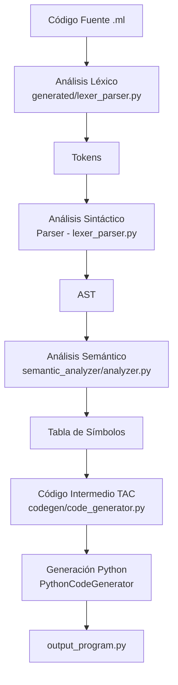

# MathLang Compiler

**Mini Lenguaje de Fórmulas Matemáticas Científicas**  
Universidad Cooperativa de Colombia — Compiladores

## Arquitectura



## Uso

```bash
python3 main.py                # compilar input.txt
python3 main.py archivo.ml    # compilar otro archivo
python3 main.py --test        # 20 pruebas automatizadas
python3 output_program.py     # ejecutar el código generado
```

## Estructura
MathLang-Compiler/
├── main.py                    # Orquestador de todas las fases
├── gramatica.g4               # Gramática ANTLR4
├── input.txt                  # Programa de prueba principal
├── output_program.py          # Código Python generado (auto)
├── output.txt                 # Log de ejecución (auto)
├── generated/
│   └── lexer_parser.py        # Fase 1 (Léxico) + Fase 2 (Sintáctico)
├── semantic_analyzer/
│   └── analyzer.py            # Fase 3: Semántico + Tabla de Símbolos
├── codegen/
│   └── code_generator.py      # Fase 4 (TAC) + Fase 5 (Python)
└── tests/
├── valid/                 # 10 pruebas válidas
└── errors/                # 10 pruebas con errores

## Sintaxis MathLang
func nombre(param1, param2) {
return expresion;
}
variable = expresion;
print(expresion);
EOF
