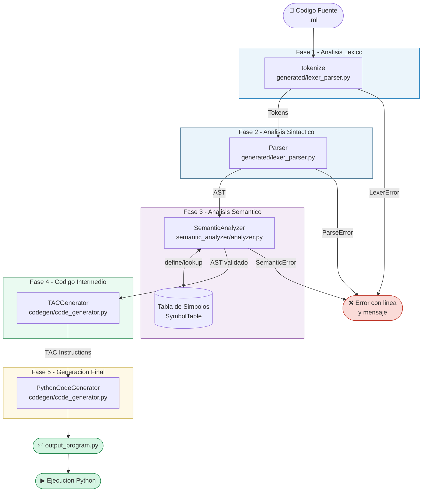

# MathLang Compiler

**Mini Lenguaje de Formulas Matematicas Cientificas**
Universidad Cooperativa de Colombia — Ingenieria de Software — Compiladores

---

## Diagrama de Arquitectura



---

## Uso

```bash
python3 main.py                 # compilar input.txt
python3 main.py archivo.ml     # compilar archivo propio
python3 main.py --test         # ejecutar 20 pruebas automatizadas
python3 output_program.py      # ejecutar el codigo Python generado
```

---

## Estructura del Proyecto

```
MathLang-Compiler/
├── main.py                        # Orquestador de todas las fases
├── gramatica.g4                   # Gramatica ANTLR4 del lenguaje
├── input.txt                      # Programa de prueba principal
├── output_program.py              # Codigo Python generado (auto)
├── output.txt                     # Log de ejecucion (auto)
├── README.md                      # Este archivo
├── generated/
│   ├── __init__.py
│   └── lexer_parser.py            # Fase 1 (Lexico) + Fase 2 (Sintactico)
├── semantic_analyzer/
│   ├── __init__.py
│   └── analyzer.py                # Fase 3: Semantico + Tabla de Simbolos
├── codegen/
│   ├── __init__.py
│   └── code_generator.py          # Fase 4 (TAC) + Fase 5 (Python)
└── tests/
    ├── valid/                     # 10 pruebas validas
    └── errors/                    # 10 pruebas con errores
```

---

## Sintaxis del Lenguaje MathLang

```
// Comentario de una linea
/* Comentario de bloque */

// Declaracion de funcion
func nombre(param1, param2) {
    return expresion;
}

// Asignacion de variable
variable = expresion;

// Imprimir resultado
print(expresion);
```

### Ejemplo completo

```
func cuadrado(x) {
    return x * x;
}

a = 5;
b = cuadrado(a) + 3;
print(b);
```

Codigo Python generado:

```python
def cuadrado(x):
    return (x * x)

a = 5
b = (cuadrado(a) + 3)
print(b)
```

Salida: `28`

---

## Fases del Compilador

| Fase | Archivo | Responsabilidad |
|------|---------|-----------------|
| Lexico | `generated/lexer_parser.py` | Tokenizacion, deteccion de caracteres ilegales |
| Sintactico | `generated/lexer_parser.py` | Parser recursivo descendente, construccion del AST |
| Semantico | `semantic_analyzer/analyzer.py` | Tabla de simbolos, ambitos, validaciones |
| Codigo Intermedio | `codegen/code_generator.py` | Generacion de TAC |
| Codigo Final | `codegen/code_generator.py` | Traduccion a Python ejecutable |

---

## Reglas Semanticas

- Variables deben declararse antes de usarse
- Funciones deben declararse antes de llamarse
- Numero de argumentos debe coincidir con parametros declarados
- `return` solo valido dentro de funciones
- Division por cero literal detectada en tiempo de compilacion

---

## Pruebas

```
python3 main.py --test
```

- 10 pruebas validas: suma, funciones, flotantes, precedencia, anidamiento, reasignacion
- 10 pruebas con errores: variable no declarada, funcion no declarada, args incorrectos,
  division por cero, caracter ilegal, falta de punto y coma, llave sin cerrar,
  return fuera de funcion

Resultado: **20/20 pruebas pasan**

---

**Universidad Cooperativa de Colombia** | Ingenieria de Software | Compiladores 2026
Danilo Andres Montezuma Ibarra | Juan Jose Burbano Bolanos | Juan Fernando Rosero Coral
